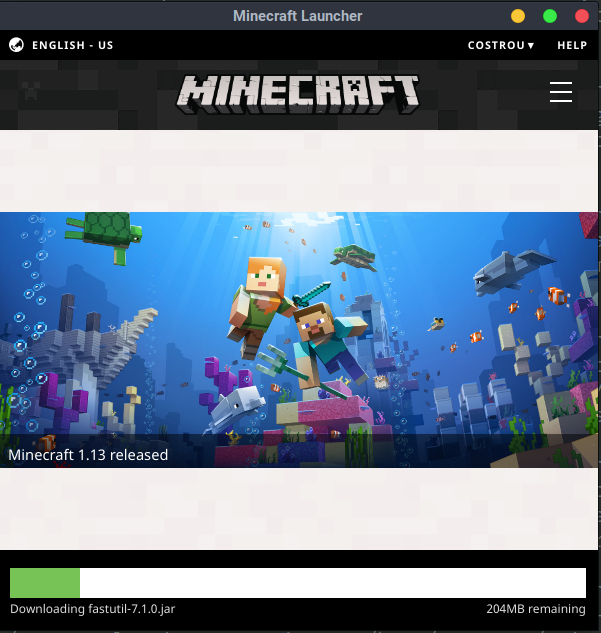
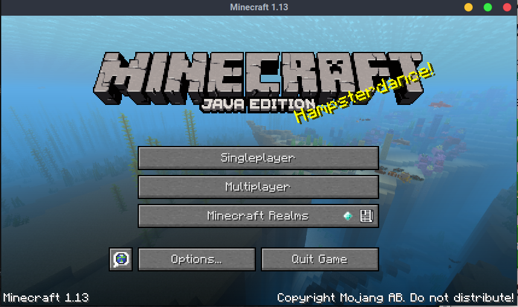
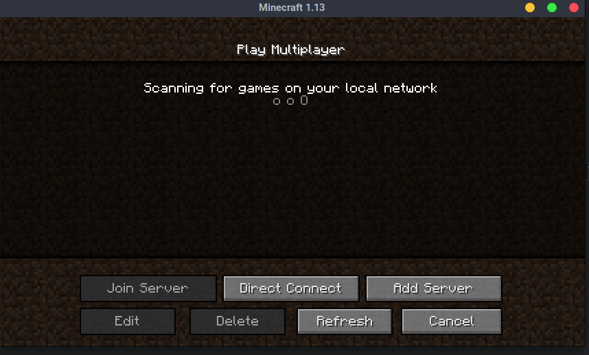
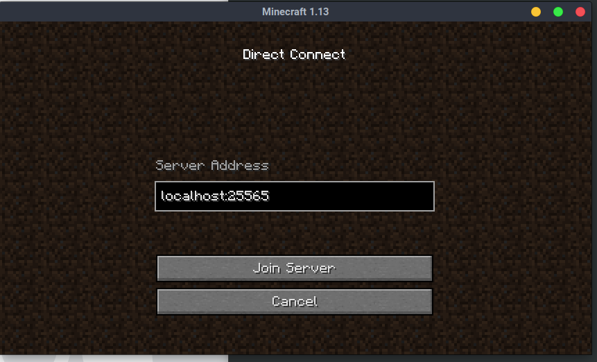

# Linux Minecraft Client Instructions

## Download and start the minecraft client

```bash
wget https://launcher.mojang.com/download/Minecraft.tar.gz
tar xf Minecraft.tar.gz
cd Minecraft*
./minecraft-launcher.sh
```

## Login with your `email` and `password`.

## Minecraft will begin installation.



## Click multiplayer to join a Minecraft Server



## Click `Direct Connect` and manually connect to `localhost:225565`





## You are in the game and ready to play!


