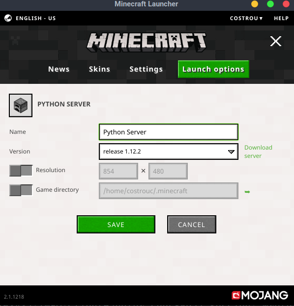
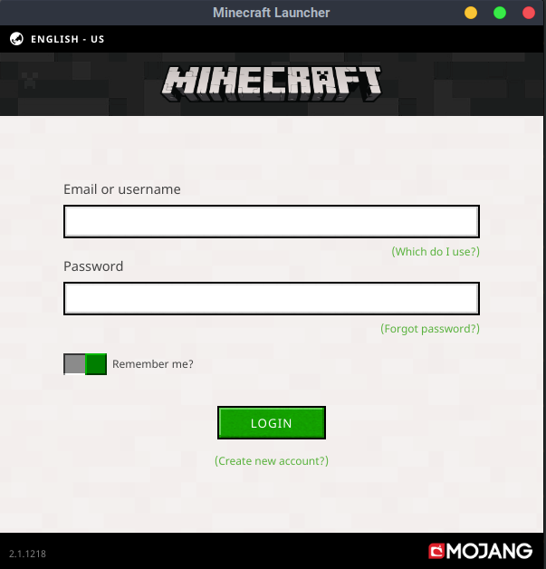

# Linux Minecraft Client Instructions

These instructions assume that you have a minecraft server running on
`localhost:25565`. For starting the minecraft server see
[server](server.md). When you run the client you will need to know the
minecraft version of the server. By default it will use the latest
release which is 1.13 as of July 19th. However using the Python Server
will require that the API is version 1.12.2. The docker image runs
`1.12.2`. You will need to [change your profile when you launch the
game](https://stickypiston.co/account/knowledgebase/71/Create-a-Profile-to-connect-to-older-Minecraft-versions-Outdated-Server.html). See
image bellow. Once you have created a `1.12.2` profile you will select
it in the play options.



## Download and start the minecraft client

```bash
wget https://launcher.mojang.com/download/Minecraft.tar.gz
tar xf Minecraft.tar.gz
cd minecraft-launcher-*
./minecraft-launcher.sh
```

## Login with your `email` and `password`



## Minecraft will begin installation.


## Click multiplayer to join a Minecraft Server


## Click `Direct Connect` and manually connect to `localhost:25565`


## You are in the game and ready to play!


