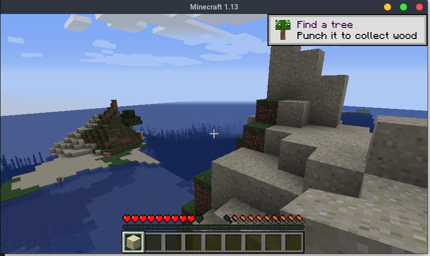

# Linux Minecraft Client Instructions

1. Download and start the minecraft client

```bash
wget https://launcher.mojang.com/download/Minecraft.tar.gz
tar xf Minecraft.tar.gz
cd Minecraft*
./minecraft-launcher.sh
```

2. Login with your `email` and `password`.

3. Minecraft will begin installation.


4. Click multiplayer to join a Minecraft Server


5. Click `Direct Connect` and manually connect to `localhost:225565`


6. You are in the game and ready to play!




