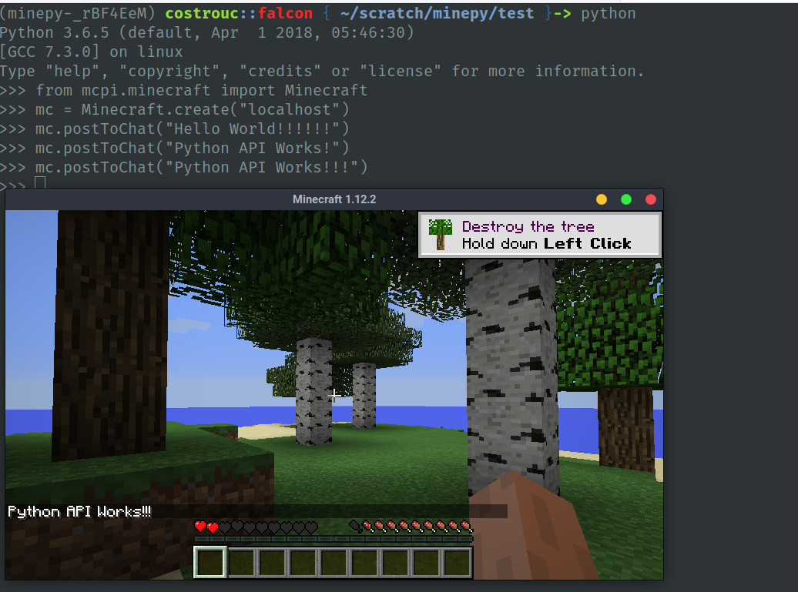
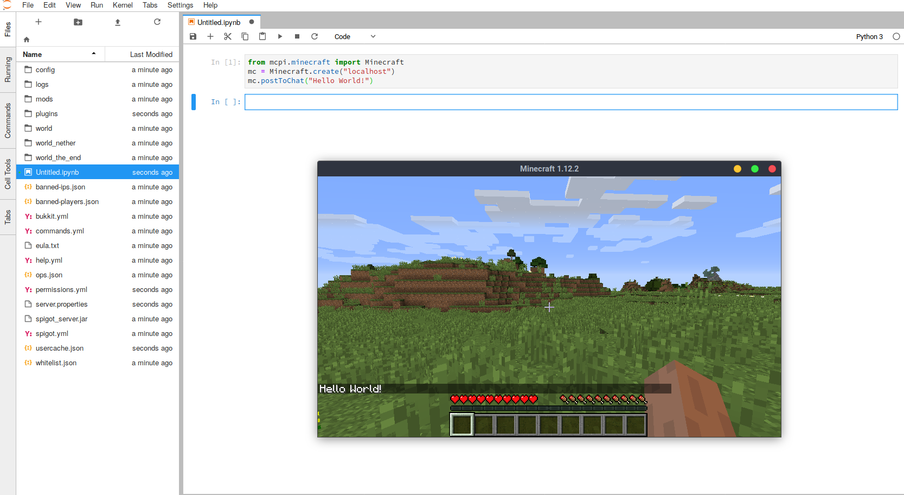

# Building the Simplest Minecraft Server

Base image will be from https://hub.docker.com/r/itzg/minecraft-server/.

Runing the most basic minecraft server can be done with the following
command.

```bash
docker run -d -it -e EULA=TRUE -p 25565:25565 --name mc itzg/minecraft-server
```

This starts a minecraft server runing as a docker process on your
machine. This minecraft has no plugins and starts from a random
seed. Run `docker ps` to check that the minecraft server is running.

```
CONTAINER ID        IMAGE                   COMMAND             CREATED             STATUS                    PORTS                                 NAMES
e652e379701c        itzg/minecraft-server   "/start"            34 minutes ago      Up 34 minutes (healthy)   0.0.0.0:25565->25565/tcp, 25575/tcp   mc
```

You can see that the server is exposed on `0.0.0.0:25565`. Thus it is
accessible to `localhost:25565` which is how we will access it on the
client. This server is not secured and does not include any of the
plugins that we would like to add.

# Minecraft Python Server

We will be running a Bukkit/Spigot server (no clue what this means).

This [wiki on itzg](https://github.com/itzg/dockerfiles/wiki/Minecraft-Pi) describes
how to get the python server running.

```bash
docker run -d -v $PWD/data/:/data \
        -e TYPE=SIGOT -e VERSION=1.8 \
        -p 255565:25565 -e EULA=TRUE --name mc itzg/minecraft-server
```

Installing python package locally (will cleanup
significantly). Eventually going to be exposed via a jupyter notebook.

```bash
pipenv install
git clone https://github.com/py3minepi/py3minepi.git
pip install .
python
```

```python
from mcpi.minecraft import Minecraft
mc = Minecraft.create("localhost")
mc.postToChat("Hello World!")
```



When running the costrouc/minecraft-python-server

```bash
docker run -p 8000:8000 -p 25565:25565 costrouc/minecraft-python-server
```



# Minecraft Python Development Server

## Requirements

 - `docker` command on machine (for server) you can run the server anywhere as long as you expose the ports
 - minecraft client downloaded from [here](https://minecraft.net/en-us/)
 - web browser (for jupyter lab)

## Instructions

I recommend running this docker command while in the `docker`
directory so that the `notebooks` are included. This way as you add
new notebooks and change existing ones they can the commited back to
the git repository. The `-v` command (volumes) maps a directory
`PWD/notebooks` on your machine to a directory `/notebooks` the docker
container. The `-p` command (port) exposes a port `8000` on your
machine to a port `8000` within the
container. `costrouc/minecraft-python-server` is the docker image that
you are running. This image exist on docker hub
[hub.docker.com/r/costrouc/minecraft-python-server](https://hub.docker.com/r/costrouc/minecraft-python-server/).

```bash
docker run -v $PWD/notebooks:/notebooks -p 8000:8000 -p 25565:25565 costrouc/minecraft-python-server
```

If you are running the server on another machine make sure that you
know the `ip` address. You will need to replace `localhost` with
`<ip>`. Also make sure that you have exposed those ports through your
firewall if you have one.

You will need to open a web browser to `localhost:8000` and a [jupyter
lab notebook](https://github.com/jupyterlab/jupyterlab) show
up. Several notebooks are provided in the
[repository](https://gitlab.com/costrouc/youth-open-data-modeling/tree/master/docker/notebooks).

Additionally you will need to start a minecraft client and "Direct
Connect" to `localhost:25565`. See [client instructions](client.md) on
how to get this setup. Note that it is important that you set your
profile to use minecraft server `1.12.2`.

## Resource Usage

Meassured with `docker stats`

 - memory usage: 1Gb - 1.2 Gb in my testing
 - network usage (over 1 hour): around 100-150 Mb
 - cpu usage: average 10% of core on laptop Intel(R) Core(TM) i5-4200U CPU @ 1.60GHz. Spikes around 60-80% of single core.
